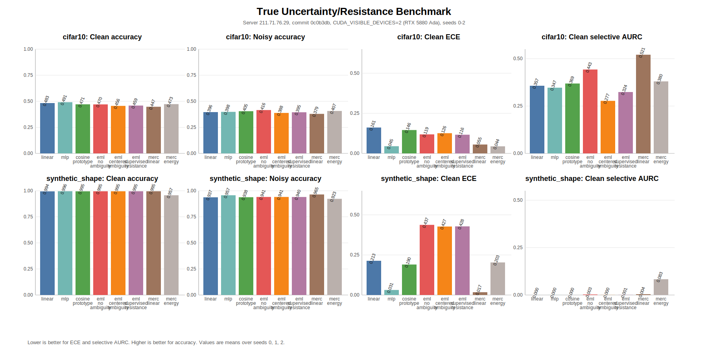

# EML Uncertainty and Resistance Benchmark

## Scope

- Frozen CNN features with head-only comparisons.
- Baselines: `linear`, `mlp`, `cosine_prototype`.
- EML heads: `eml_no_ambiguity`, `eml_centered_ambiguity`, `eml_supervised_resistance`.
- MERC heads: `merc_linear`, `merc_energy`.
- Corruption tasks: SyntheticShape clean/noisy/occluded; CIFAR clean/noisy/occluded when `torchvision` and data are available.
- Synthetic label-noise ablation: NOT RUN in this report; it remains optional and should be added only with explicit label-noise controls.
- Clean CIFAR accuracy claims are intentionally conservative.

## Execution Notes

- Remote server: `211.71.76.29` (`user-NF5468M6`).
- Code commit: `0c0b3db`.
- Dataset path: `/data16T/hyq/dataset/data`.
- Device selection: `CUDA_VISIBLE_DEVICES=2`; preflight reported `NVIDIA RTX 5880 Ada Generation`. GPU 0 was `NVIDIA TITAN Xp` and was not used.
- Command:

```bash
CUDA_VISIBLE_DEVICES=2 /data16T/hyq/miniconda3/envs/simgcd/bin/python scripts/run_uncertainty_resistance_benchmark.py \
  --mode medium \
  --dataset all \
  --device cuda \
  --data-dir /data16T/hyq/dataset/data \
  --num-workers 0 \
  --batch-size 64 \
  --seeds 0 1 2 \
  --early-stop-patience 4 \
  --early-stop-min-evals 2 \
  --runs-root reports/uncertainty_resistance_true_20260427/runs \
  --report reports/EML_UNCERTAINTY_RESISTANCE_TRUE_REPORT.md
```

- Server `pytest` status: NOT RUN. The server conda environment reported `No module named pytest`; the experiment environment was not modified during this run.
- Pulled artifacts exclude `uncertainty_eval.pt` tensors to keep Git artifacts lightweight; CSV, JSON, Markdown, and stdout log artifacts are included.

## Run Status

| run_id | status | model | dataset | reason |
| --- | --- | --- | --- | --- |
| uncertainty_synthetic_shape_linear_seed0 | COMPLETED | linear | synthetic_shape |  |
| uncertainty_synthetic_shape_mlp_seed0 | COMPLETED | mlp | synthetic_shape |  |
| uncertainty_synthetic_shape_cosine_prototype_seed0 | COMPLETED | cosine_prototype | synthetic_shape |  |
| uncertainty_synthetic_shape_eml_no_ambiguity_seed0 | COMPLETED | eml_no_ambiguity | synthetic_shape |  |
| uncertainty_synthetic_shape_eml_centered_ambiguity_seed0 | COMPLETED | eml_centered_ambiguity | synthetic_shape |  |
| uncertainty_synthetic_shape_eml_supervised_resistance_seed0 | COMPLETED | eml_supervised_resistance | synthetic_shape |  |
| uncertainty_synthetic_shape_merc_linear_seed0 | COMPLETED | merc_linear | synthetic_shape |  |
| uncertainty_synthetic_shape_merc_energy_seed0 | COMPLETED | merc_energy | synthetic_shape |  |
| uncertainty_synthetic_shape_linear_seed1 | COMPLETED | linear | synthetic_shape |  |
| uncertainty_synthetic_shape_mlp_seed1 | COMPLETED | mlp | synthetic_shape |  |
| uncertainty_synthetic_shape_cosine_prototype_seed1 | COMPLETED | cosine_prototype | synthetic_shape |  |
| uncertainty_synthetic_shape_eml_no_ambiguity_seed1 | COMPLETED | eml_no_ambiguity | synthetic_shape |  |
| uncertainty_synthetic_shape_eml_centered_ambiguity_seed1 | COMPLETED | eml_centered_ambiguity | synthetic_shape |  |
| uncertainty_synthetic_shape_eml_supervised_resistance_seed1 | COMPLETED | eml_supervised_resistance | synthetic_shape |  |
| uncertainty_synthetic_shape_merc_linear_seed1 | COMPLETED | merc_linear | synthetic_shape |  |
| uncertainty_synthetic_shape_merc_energy_seed1 | COMPLETED | merc_energy | synthetic_shape |  |
| uncertainty_synthetic_shape_linear_seed2 | COMPLETED | linear | synthetic_shape |  |
| uncertainty_synthetic_shape_mlp_seed2 | COMPLETED | mlp | synthetic_shape |  |
| uncertainty_synthetic_shape_cosine_prototype_seed2 | COMPLETED | cosine_prototype | synthetic_shape |  |
| uncertainty_synthetic_shape_eml_no_ambiguity_seed2 | COMPLETED | eml_no_ambiguity | synthetic_shape |  |
| uncertainty_synthetic_shape_eml_centered_ambiguity_seed2 | COMPLETED | eml_centered_ambiguity | synthetic_shape |  |
| uncertainty_synthetic_shape_eml_supervised_resistance_seed2 | COMPLETED | eml_supervised_resistance | synthetic_shape |  |
| uncertainty_synthetic_shape_merc_linear_seed2 | COMPLETED | merc_linear | synthetic_shape |  |
| uncertainty_synthetic_shape_merc_energy_seed2 | COMPLETED | merc_energy | synthetic_shape |  |
| uncertainty_cifar10_linear_seed0 | COMPLETED | linear | cifar10 |  |
| uncertainty_cifar10_mlp_seed0 | COMPLETED | mlp | cifar10 |  |
| uncertainty_cifar10_cosine_prototype_seed0 | COMPLETED | cosine_prototype | cifar10 |  |
| uncertainty_cifar10_eml_no_ambiguity_seed0 | COMPLETED | eml_no_ambiguity | cifar10 |  |
| uncertainty_cifar10_eml_centered_ambiguity_seed0 | COMPLETED | eml_centered_ambiguity | cifar10 |  |
| uncertainty_cifar10_eml_supervised_resistance_seed0 | COMPLETED | eml_supervised_resistance | cifar10 |  |
| uncertainty_cifar10_merc_linear_seed0 | COMPLETED | merc_linear | cifar10 |  |
| uncertainty_cifar10_merc_energy_seed0 | COMPLETED | merc_energy | cifar10 |  |
| uncertainty_cifar10_linear_seed1 | COMPLETED | linear | cifar10 |  |
| uncertainty_cifar10_mlp_seed1 | COMPLETED | mlp | cifar10 |  |
| uncertainty_cifar10_cosine_prototype_seed1 | COMPLETED | cosine_prototype | cifar10 |  |
| uncertainty_cifar10_eml_no_ambiguity_seed1 | COMPLETED | eml_no_ambiguity | cifar10 |  |
| uncertainty_cifar10_eml_centered_ambiguity_seed1 | COMPLETED | eml_centered_ambiguity | cifar10 |  |
| uncertainty_cifar10_eml_supervised_resistance_seed1 | COMPLETED | eml_supervised_resistance | cifar10 |  |
| uncertainty_cifar10_merc_linear_seed1 | COMPLETED | merc_linear | cifar10 |  |
| uncertainty_cifar10_merc_energy_seed1 | COMPLETED | merc_energy | cifar10 |  |
| uncertainty_cifar10_linear_seed2 | COMPLETED | linear | cifar10 |  |
| uncertainty_cifar10_mlp_seed2 | COMPLETED | mlp | cifar10 |  |
| uncertainty_cifar10_cosine_prototype_seed2 | COMPLETED | cosine_prototype | cifar10 |  |
| uncertainty_cifar10_eml_no_ambiguity_seed2 | COMPLETED | eml_no_ambiguity | cifar10 |  |
| uncertainty_cifar10_eml_centered_ambiguity_seed2 | COMPLETED | eml_centered_ambiguity | cifar10 |  |
| uncertainty_cifar10_eml_supervised_resistance_seed2 | COMPLETED | eml_supervised_resistance | cifar10 |  |
| uncertainty_cifar10_merc_linear_seed2 | COMPLETED | merc_linear | cifar10 |  |
| uncertainty_cifar10_merc_energy_seed2 | COMPLETED | merc_energy | cifar10 |  |

## cifar10

| model | clean acc | noisy acc | occluded acc | clean ECE | clean Brier | clean selective AURC | clean->noisy AUROC | clean->occluded AUROC | resistance-noise corr | resistance-occlusion corr | support-evidence corr | conflict-resistance corr |
| --- | ---: | ---: | ---: | ---: | ---: | ---: | ---: | ---: | ---: | ---: | ---: | ---: |
| cosine_prototype | 0.4709 | 0.4049 | 0.4339 | 0.1458 | 0.6981 | 0.3689 | 0.5842 | 0.5345 | MISSING | MISSING | MISSING | MISSING |
| eml_centered_ambiguity | 0.4557 | 0.3883 | 0.4154 | 0.1260 | 0.7104 | 0.2772 | 0.5435 | 0.5254 | 0.0495 | 0.0005 | MISSING | MISSING |
| eml_no_ambiguity | 0.4701 | 0.4157 | 0.4359 | 0.1188 | 0.6945 | 0.4426 | 0.5202 | 0.5167 | 0.0085 | -0.0016 | MISSING | MISSING |
| eml_supervised_resistance | 0.4588 | 0.3945 | 0.4242 | 0.1165 | 0.7014 | 0.3237 | 0.6683 | 0.5282 | 0.2592 | -0.1238 | MISSING | MISSING |
| linear | 0.4831 | 0.3962 | 0.4388 | 0.1613 | 0.7028 | 0.3569 | 0.5889 | 0.5416 | MISSING | MISSING | MISSING | MISSING |
| merc_energy | 0.4727 | 0.4072 | 0.4196 | 0.0442 | 0.6678 | 0.3800 | 0.5548 | 0.5220 | 0.0435 | -0.0090 | MISSING | 0.0285 |
| merc_linear | 0.4475 | 0.3792 | 0.4053 | 0.0553 | 0.6862 | 0.5208 | 0.5107 | 0.4942 | 0.0225 | -0.0189 | MISSING | -0.0048 |
| mlp | 0.4913 | 0.3984 | 0.4476 | 0.0449 | 0.6556 | 0.3468 | 0.5238 | 0.5024 | MISSING | MISSING | MISSING | MISSING |

### cifar10 Detailed Runs

| run_id | model | seed | best step | steps run | early stop | clean acc | clean ECE | clean AURC | noisy acc | occluded acc |
| --- | --- | ---: | ---: | ---: | --- | ---: | ---: | ---: | ---: | ---: |
| uncertainty_cifar10_cosine_prototype_seed0 | cosine_prototype | 0 | 175 | 250 | False | 0.4609 | 0.1031 | 0.3950 | 0.4268 | 0.4316 |
| uncertainty_cifar10_cosine_prototype_seed1 | cosine_prototype | 1 | 75 | 175 | True | 0.4792 | 0.1627 | 0.3611 | 0.4131 | 0.4414 |
| uncertainty_cifar10_cosine_prototype_seed2 | cosine_prototype | 2 | 75 | 175 | True | 0.4727 | 0.1715 | 0.3506 | 0.3750 | 0.4287 |
| uncertainty_cifar10_eml_centered_ambiguity_seed0 | eml_centered_ambiguity | 0 | 225 | 250 | False | 0.4635 | 0.1205 | 0.2413 | 0.4209 | 0.4502 |
| uncertainty_cifar10_eml_centered_ambiguity_seed1 | eml_centered_ambiguity | 1 | 150 | 250 | True | 0.4870 | 0.1451 | 0.2448 | 0.3984 | 0.4238 |
| uncertainty_cifar10_eml_centered_ambiguity_seed2 | eml_centered_ambiguity | 2 | 100 | 200 | True | 0.4167 | 0.1125 | 0.3456 | 0.3457 | 0.3721 |
| uncertainty_cifar10_eml_no_ambiguity_seed0 | eml_no_ambiguity | 0 | 200 | 250 | False | 0.4583 | 0.1151 | 0.4383 | 0.4189 | 0.4404 |
| uncertainty_cifar10_eml_no_ambiguity_seed1 | eml_no_ambiguity | 1 | 200 | 250 | False | 0.4753 | 0.1280 | 0.4605 | 0.4365 | 0.4404 |
| uncertainty_cifar10_eml_no_ambiguity_seed2 | eml_no_ambiguity | 2 | 250 | 250 | False | 0.4766 | 0.1132 | 0.4291 | 0.3916 | 0.4268 |
| uncertainty_cifar10_eml_supervised_resistance_seed0 | eml_supervised_resistance | 0 | 200 | 250 | False | 0.4544 | 0.1101 | 0.3343 | 0.4316 | 0.4473 |
| uncertainty_cifar10_eml_supervised_resistance_seed1 | eml_supervised_resistance | 1 | 250 | 250 | False | 0.5091 | 0.1302 | 0.2621 | 0.4082 | 0.4473 |
| uncertainty_cifar10_eml_supervised_resistance_seed2 | eml_supervised_resistance | 2 | 100 | 200 | True | 0.4128 | 0.1091 | 0.3748 | 0.3438 | 0.3779 |
| uncertainty_cifar10_linear_seed0 | linear | 0 | 250 | 250 | False | 0.4596 | 0.0598 | 0.4063 | 0.4229 | 0.4473 |
| uncertainty_cifar10_linear_seed1 | linear | 1 | 100 | 200 | True | 0.4909 | 0.1823 | 0.3519 | 0.3955 | 0.4492 |
| uncertainty_cifar10_linear_seed2 | linear | 2 | 75 | 175 | True | 0.4987 | 0.2419 | 0.3124 | 0.3701 | 0.4199 |
| uncertainty_cifar10_merc_energy_seed0 | merc_energy | 0 | 250 | 250 | False | 0.4401 | 0.0546 | 0.3942 | 0.4014 | 0.4053 |
| uncertainty_cifar10_merc_energy_seed1 | merc_energy | 1 | 250 | 250 | False | 0.4792 | 0.0424 | 0.4030 | 0.4111 | 0.4248 |
| uncertainty_cifar10_merc_energy_seed2 | merc_energy | 2 | 250 | 250 | False | 0.4987 | 0.0356 | 0.3427 | 0.4092 | 0.4287 |
| uncertainty_cifar10_merc_linear_seed0 | merc_linear | 0 | 200 | 250 | False | 0.4388 | 0.0497 | 0.5924 | 0.3906 | 0.3857 |
| uncertainty_cifar10_merc_linear_seed1 | merc_linear | 1 | 200 | 250 | False | 0.4609 | 0.0576 | 0.4721 | 0.4072 | 0.4258 |
| uncertainty_cifar10_merc_linear_seed2 | merc_linear | 2 | 125 | 225 | True | 0.4427 | 0.0586 | 0.4978 | 0.3398 | 0.4043 |
| uncertainty_cifar10_mlp_seed0 | mlp | 0 | 150 | 250 | True | 0.4883 | 0.0239 | 0.3679 | 0.4043 | 0.4541 |
| uncertainty_cifar10_mlp_seed1 | mlp | 1 | 50 | 150 | True | 0.4701 | 0.0704 | 0.3691 | 0.3809 | 0.4297 |
| uncertainty_cifar10_mlp_seed2 | mlp | 2 | 200 | 250 | False | 0.5156 | 0.0405 | 0.3033 | 0.4102 | 0.4590 |

## synthetic_shape

| model | clean acc | noisy acc | occluded acc | clean ECE | clean Brier | clean selective AURC | clean->noisy AUROC | clean->occluded AUROC | resistance-noise corr | resistance-occlusion corr | support-evidence corr | conflict-resistance corr |
| --- | ---: | ---: | ---: | ---: | ---: | ---: | ---: | ---: | ---: | ---: | ---: | ---: |
| cosine_prototype | 0.9948 | 0.9382 | 0.8910 | 0.1900 | 0.0602 | 0.0001 | 0.6423 | 0.6099 | MISSING | MISSING | MISSING | MISSING |
| eml_centered_ambiguity | 0.9952 | 0.9408 | 0.8910 | 0.4269 | 0.2750 | 0.0004 | 0.6102 | 0.5910 | 0.0592 | 0.3346 | MISSING | MISSING |
| eml_no_ambiguity | 0.9952 | 0.9408 | 0.8906 | 0.4374 | 0.2847 | 0.0026 | 0.5415 | 0.4772 | 0.0476 | -0.0453 | MISSING | MISSING |
| eml_supervised_resistance | 0.9952 | 0.9404 | 0.8906 | 0.4281 | 0.2761 | 0.0006 | 0.6499 | 0.5876 | 0.0823 | 0.3497 | MISSING | MISSING |
| linear | 0.9944 | 0.9372 | 0.8916 | 0.2134 | 0.0834 | 0.0001 | 0.6670 | 0.6281 | MISSING | MISSING | MISSING | MISSING |
| merc_energy | 0.9570 | 0.9225 | 0.8600 | 0.2031 | 0.2218 | 0.0832 | 0.5245 | 0.5760 | -0.0552 | 0.3682 | MISSING | -0.0168 |
| merc_linear | 0.9952 | 0.9645 | 0.8965 | 0.0175 | 0.0127 | 0.0042 | 0.5041 | 0.4907 | 0.0102 | -0.0069 | MISSING | -0.0971 |
| mlp | 0.9957 | 0.9570 | 0.9046 | 0.0313 | 0.0151 | 0.0001 | 0.5587 | 0.6033 | MISSING | MISSING | MISSING | MISSING |

### synthetic_shape Detailed Runs

| run_id | model | seed | best step | steps run | early stop | clean acc | clean ECE | clean AURC | noisy acc | occluded acc |
| --- | --- | ---: | ---: | ---: | --- | ---: | ---: | ---: | ---: | ---: |
| uncertainty_synthetic_shape_cosine_prototype_seed0 | cosine_prototype | 0 | 125 | 225 | True | 0.9935 | 0.1796 | 0.0001 | 0.8955 | 0.8721 |
| uncertainty_synthetic_shape_cosine_prototype_seed1 | cosine_prototype | 1 | 75 | 175 | True | 0.9935 | 0.2056 | 0.0001 | 0.9814 | 0.8965 |
| uncertainty_synthetic_shape_cosine_prototype_seed2 | cosine_prototype | 2 | 100 | 200 | True | 0.9974 | 0.1850 | 0.0000 | 0.9375 | 0.9043 |
| uncertainty_synthetic_shape_eml_centered_ambiguity_seed0 | eml_centered_ambiguity | 0 | 50 | 150 | True | 0.9922 | 0.3899 | 0.0006 | 0.8789 | 0.8711 |
| uncertainty_synthetic_shape_eml_centered_ambiguity_seed1 | eml_centered_ambiguity | 1 | 25 | 125 | True | 0.9961 | 0.6309 | 0.0007 | 0.9766 | 0.8896 |
| uncertainty_synthetic_shape_eml_centered_ambiguity_seed2 | eml_centered_ambiguity | 2 | 125 | 225 | True | 0.9974 | 0.2600 | 0.0000 | 0.9668 | 0.9121 |
| uncertainty_synthetic_shape_eml_no_ambiguity_seed0 | eml_no_ambiguity | 0 | 50 | 150 | True | 0.9922 | 0.3992 | 0.0024 | 0.8789 | 0.8711 |
| uncertainty_synthetic_shape_eml_no_ambiguity_seed1 | eml_no_ambiguity | 1 | 25 | 125 | True | 0.9961 | 0.6368 | 0.0029 | 0.9766 | 0.8896 |
| uncertainty_synthetic_shape_eml_no_ambiguity_seed2 | eml_no_ambiguity | 2 | 125 | 225 | True | 0.9974 | 0.2762 | 0.0026 | 0.9668 | 0.9111 |
| uncertainty_synthetic_shape_eml_supervised_resistance_seed0 | eml_supervised_resistance | 0 | 50 | 150 | True | 0.9922 | 0.3895 | 0.0006 | 0.8779 | 0.8691 |
| uncertainty_synthetic_shape_eml_supervised_resistance_seed1 | eml_supervised_resistance | 1 | 25 | 125 | True | 0.9961 | 0.6332 | 0.0012 | 0.9766 | 0.8906 |
| uncertainty_synthetic_shape_eml_supervised_resistance_seed2 | eml_supervised_resistance | 2 | 125 | 225 | True | 0.9974 | 0.2616 | 0.0000 | 0.9668 | 0.9121 |
| uncertainty_synthetic_shape_linear_seed0 | linear | 0 | 150 | 250 | True | 0.9935 | 0.1365 | 0.0001 | 0.9092 | 0.8721 |
| uncertainty_synthetic_shape_linear_seed1 | linear | 1 | 100 | 200 | True | 0.9935 | 0.1496 | 0.0001 | 0.9814 | 0.9004 |
| uncertainty_synthetic_shape_linear_seed2 | linear | 2 | 50 | 150 | True | 0.9961 | 0.3542 | 0.0001 | 0.9209 | 0.9023 |
| uncertainty_synthetic_shape_merc_energy_seed0 | merc_energy | 0 | 25 | 125 | True | 0.8776 | 0.5945 | 0.2487 | 0.8203 | 0.7764 |
| uncertainty_synthetic_shape_merc_energy_seed1 | merc_energy | 1 | 75 | 175 | True | 0.9961 | 0.0087 | 0.0006 | 0.9795 | 0.8945 |
| uncertainty_synthetic_shape_merc_energy_seed2 | merc_energy | 2 | 100 | 200 | True | 0.9974 | 0.0060 | 0.0004 | 0.9678 | 0.9092 |
| uncertainty_synthetic_shape_merc_linear_seed0 | merc_linear | 0 | 75 | 175 | True | 0.9909 | 0.0468 | 0.0067 | 0.9443 | 0.8809 |
| uncertainty_synthetic_shape_merc_linear_seed1 | merc_linear | 1 | 75 | 175 | True | 0.9974 | 0.0044 | 0.0015 | 0.9814 | 0.9014 |
| uncertainty_synthetic_shape_merc_linear_seed2 | merc_linear | 2 | 100 | 200 | True | 0.9974 | 0.0013 | 0.0045 | 0.9678 | 0.9072 |
| uncertainty_synthetic_shape_mlp_seed0 | mlp | 0 | 50 | 150 | True | 0.9935 | 0.0794 | 0.0004 | 0.9238 | 0.8945 |
| uncertainty_synthetic_shape_mlp_seed1 | mlp | 1 | 75 | 175 | True | 0.9961 | 0.0092 | 0.0000 | 0.9805 | 0.9062 |
| uncertainty_synthetic_shape_mlp_seed2 | mlp | 2 | 100 | 200 | True | 0.9974 | 0.0054 | 0.0000 | 0.9668 | 0.9131 |

## Conclusions



- `cifar10` clean accuracy vs cosine: EML centered 0.4557 vs cosine 0.4709. Head advantage is not supported.
- `cifar10` calibration vs cosine: EML centered ECE 0.1260 vs cosine 0.1458. Calibration is better.
- `cifar10` selective prediction vs cosine: EML centered clean AURC 0.2772 vs cosine 0.3689. Selective prediction is better.
- `cifar10` resistance-correlation check: noise 0.2592, occlusion -0.1238. Corruption correlation is supported.
- `cifar10` MERC support/conflict alignment: support-evidence MISSING, conflict-resistance 0.0119. MERC alignment is not claimed when values are MISSING or weak.
- `synthetic_shape` clean accuracy vs cosine: EML centered 0.9952 vs cosine 0.9948. Head advantage is supported in this benchmark only.
- `synthetic_shape` calibration vs cosine: EML centered ECE 0.4269 vs cosine 0.1900. Calibration is not better.
- `synthetic_shape` selective prediction vs cosine: EML centered clean AURC 0.0004 vs cosine 0.0001. Selective prediction is not better.
- `synthetic_shape` resistance-correlation check: noise 0.0823, occlusion 0.3497. Corruption correlation is supported.
- `synthetic_shape` MERC support/conflict alignment: support-evidence MISSING, conflict-resistance -0.0570. MERC alignment is not claimed when values are MISSING or weak.

- If the EML rows do not beat cosine on calibration or selective risk, the benchmark does not support an EML head advantage.

## Raw Artifacts

- Runs root: `reports/uncertainty_resistance_true_20260427/runs`
- Summary CSV: `reports/uncertainty_resistance_true_20260427/runs/summary.csv`
